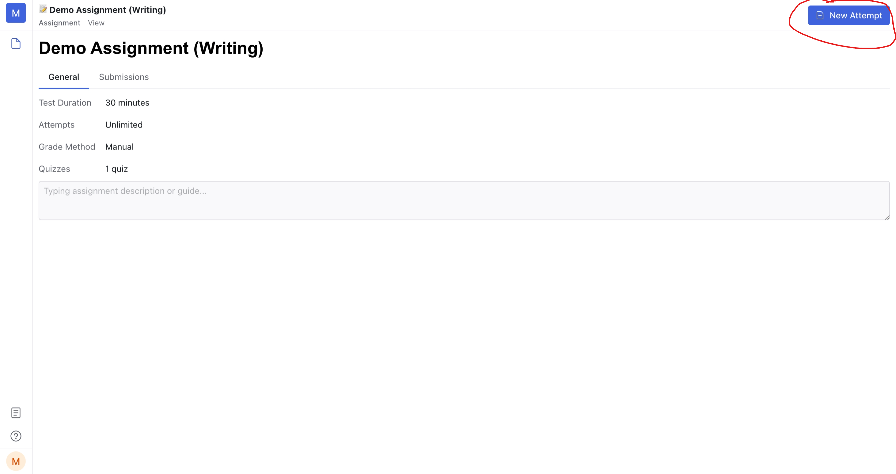
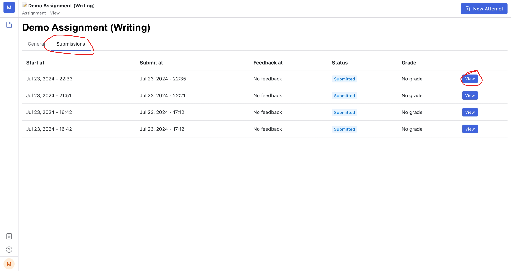

import { Bleed } from 'nextra-theme-docs'

# Do an assignment (Start submission)

> This section is used for student
<Bleed>
  <iframe
    src="https://www.loom.com/embed/8eecaa735a044b56ba1fb42d3c2dd788?sid=9cee5526-33b5-41bf-b333-37357e5ed5f7"
    frameBorder="0"
    webkitAllowFullScreen
    mozAllowFullScreen
    allowFullScreen
    style={{top: 0, left: 0, width: "100%", height: "350px"}}
  >
  </iframe>
</Bleed>

To start the assignment, click on the "New attempt" button at the top right of the page.
A popup will appear to confirm that you're ready to begin the assignment.

## Start a submission

At the bottom of the submission, you'll see a list of pages.
Click on a page to switch to it. Within each page, there is a list of quizzes.

Clicking on a quiz circle will take you to the corresponding quiz.
The quiz circles are color-coded to indicate their status:

- **Gray:** Not answered yet
- **Blue:** Answered
- **Green:** Correct answer (after teacher release)
- **Red:** Incorrect answer (after teacher release)

## Submit

After you complete your submission, click the "Submit" button at the top right of the page.
Note that you cannot edit your submission once it has been submitted.

## Save & Exit

If you wish to close the submission and return to edit it later,
click the "Save & Exit" button next to the "Submit" button.

## Time Duration

At the top center of the submission page, you will see a countdown timer displaying the test duration.
When the timer reaches zero, your submission will be automatically submitted.

## Review or Continue last submission

After you submit or "Save & Exit" your submission, you will be navigated to the assignment page.
You can review or continue your last submission by clicking on the "Submissions" tab.
Click the "view" button on the right of the submission (by the attempt times) to jump back to the submission.

