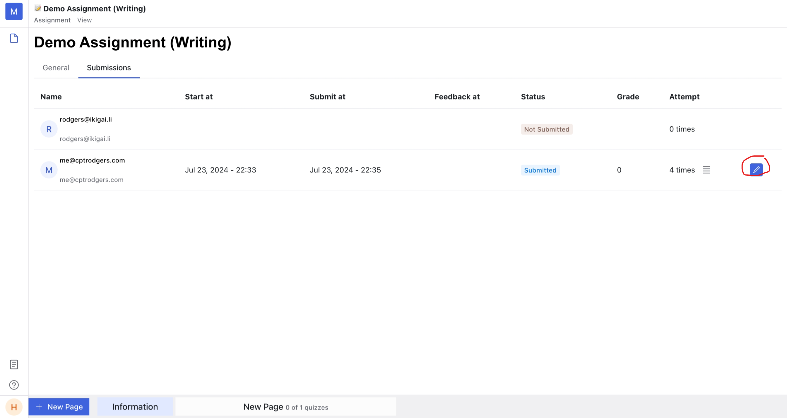
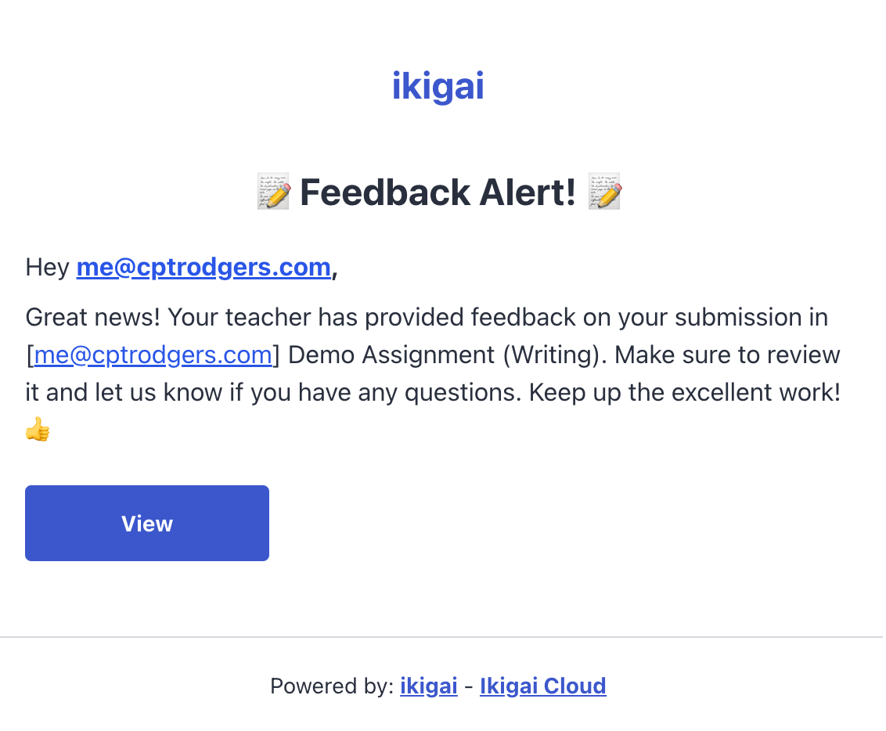

import { Bleed } from 'nextra-theme-docs'

# Feedback student's submission
> This section is used for owner/teacher

<Bleed>
  <iframe
    src="https://www.loom.com/embed/4f1c79a83f71402e8ff4085d09edab35?sid=a07c065f-5402-4779-99c8-45a143e1ab33"
    frameBorder="0"
    webkitAllowFullScreen
    mozAllowFullScreen
    allowFullScreen
    style={{top: 0, left: 0, width: "100%", height: "350px"}}
  >
  </iframe>
</Bleed>

## View submission list

In the assignment page, you can see the "submission" tab. Click on it to view submissions of this assignment.

## Start review the student's submission

In the "Submissions" tab, you will see the list of student submissions and their status:
- **Not Submitted**: Student has not started the submission.
- **In Progress**: Student has started the submission but has not completed/submitted it yet.
- **Submitted**: Student has submitted the submission, but the teacher has not reviewed it.
- **Graded**: Student has submitted the submission, and the teacher has provided feedback/graded it.

To start reviewing a submission, click on the "pencil" button at the end of the line. This will navigate you to the student's submission.

You can use the toolbar (similar to the one used for completing the assignment) to provide feedback on student submissions.
On the right side, you will see the Grading section, which includes the student's submission information such as quizzes, time, draft score, and feedback. Once you have graded the submission, click "Feedback" to release the grade to the student..

## Switch to another student's submission

On the top of the submission page, you can click on the student's name to view a list of other students.
From there, you can select another submission to continue your review.
