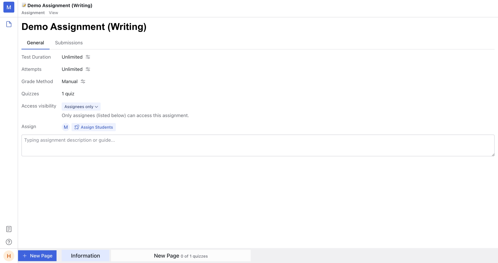
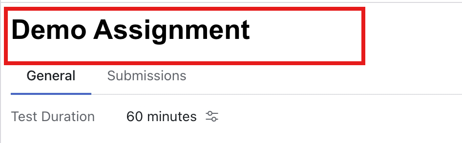
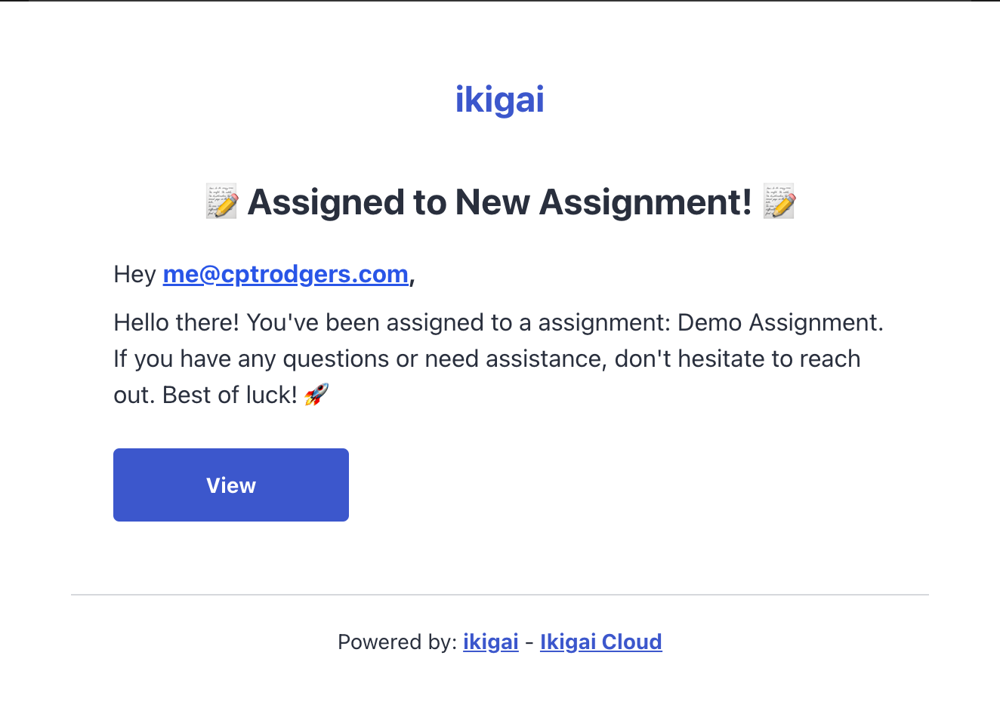

import { Bleed } from 'nextra-theme-docs'

# Assignment Configurations
> This section is used for teacher/owner

<Bleed>
  <iframe
    src="https://www.loom.com/embed/cf0a5727c14245fe8c2614b23b84b5ed?sid=173faeb2-0c9e-4586-9356-1e7e955dc7f2"
    frameBorder="0"
    webkitAllowFullScreen
    mozAllowFullScreen
    allowFullScreen
    style={{top: 0, left: 0, width: "100%", height: "350px"}}
  >
  </iframe>
</Bleed>

Assignment configurations placed in Information Page of assignment.
Click on the right setting button to edit the config.

It will look like image below.

## Change assignment name

You can click on the title of the assignment and then type to edit it.

## Test duration
The "Test duration" configuration allows you to set the maximum time a student can spend on the submission.
The unit is in minutes.

You can choose between unlimited time or limited time.
In unlimited time mode, students can start a submission and save it without needing to submit.
In limited time mode, the system will automatically submit the submission when the time is completed.

## Attempts

The "Attempts" configuration sets the maximum number of times a student can start a submission for the assignment.

**Note:** If you grade one of the student's submissions,
that student cannot start a new submission because they can view the latest results.

## Grade method

There are two options for the grading method:

- **Manual:** Ikigai will automatically draft the grade. Teachers need to review the submission, provide feedback,
and release the grade to the student. The manual grading option is best for writing and speaking assignments.

- **Auto:** Ikigai will automatically grade and release the score to the student. Teachers can review and change it later.
The auto grading option is best suited for choice questions, fill-in-the-blank, and similar types of assignments.

## Quizzes

This is a non-configurable attribute; it simply counts the total number of quizzes or questions that a student needs to complete.

## Access visibility

The "Access visibility" configuration allows you to control which students can access the assignment. It has three modes:

- **Private:** Only you (the teacher) can view it.
- **Public:** Any member of the space can view it.
- **Assignees:** Only the assignees (listed in the section below) who are assigned to this assignment by you can view it.

## Assign

The "Assign" configuration only appears when ["Access visibility"](/assignment_docs/setting_and_assign_assignment#access-visibility) is set to Public or Assignees.

Teachers assign students via their email addresses. Each assignee will receive a magic link in their email, which they can open to access the assignment **without needing to log in or register**.
You can remove assignees by clicking on the assignees list and choosing the remove button.

**Note:** Mobile view is not yet supported. We recommend not opening the assignment link on your phone. If you need mobile support, please let us know via our community.

Email example

## Description of Assignment

This configuration is the bottom text input where you can type any message to your students.
