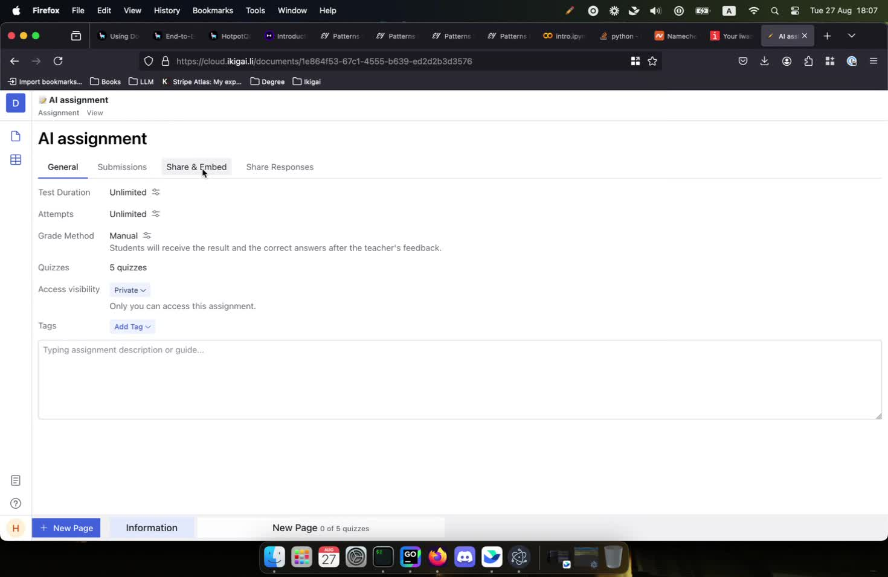
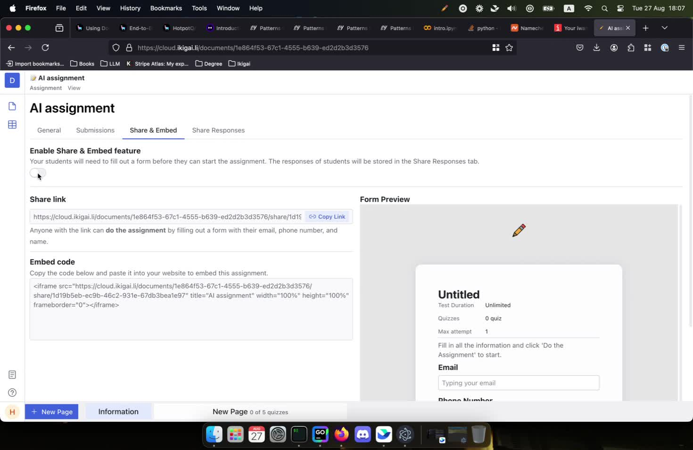
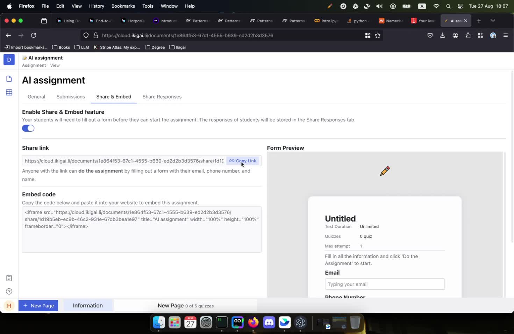
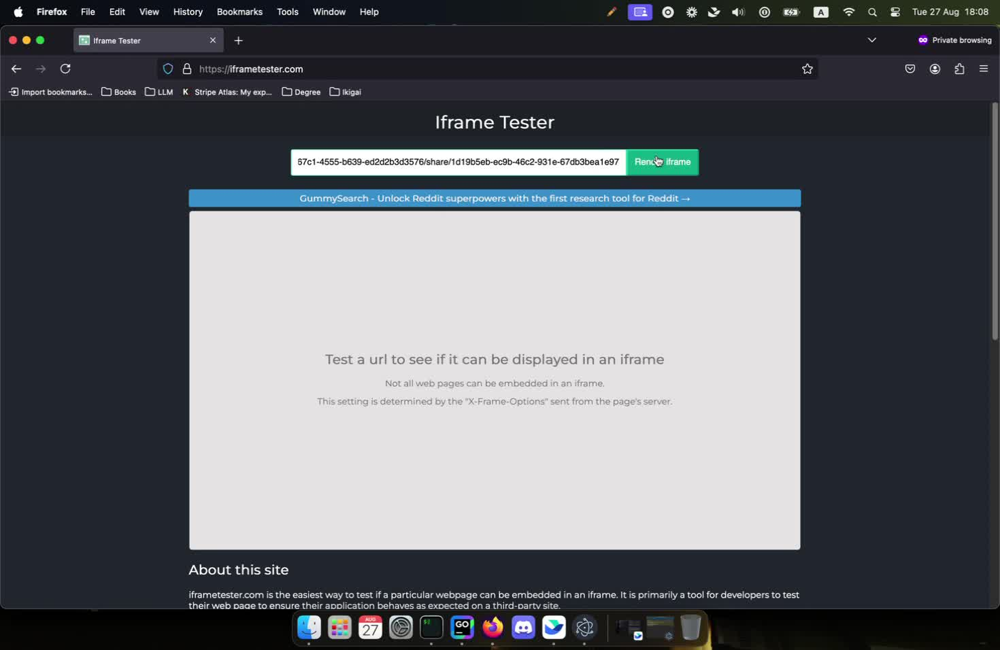
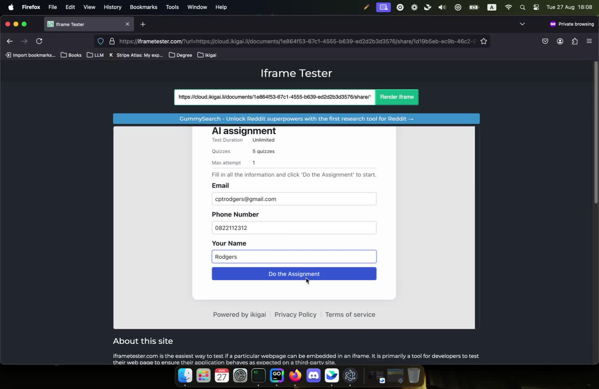
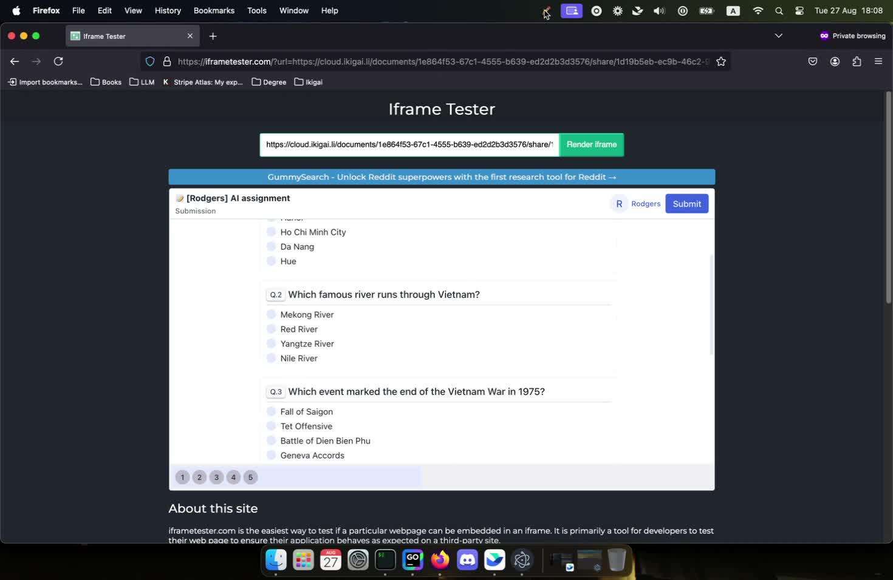

## Guide to Share And Embed the Assignment

### Step 1: Navigate to the 'Share & Embed' section in your dashboard.

### Step 2: Enable the 'Share & Embed' feature to access sharing options.

### Step 3: Copy the provided share link for the assignment.

### Step 4: (Testing) Open the Iframe Tester to check if the link can be displayed.

### Step 5: (Testing) Fill in the required information in the Iframe Tester form.

### Step 6: (Testing) Submit the form to view the assignment questions.

> Generated by Record Wise
> Aug 27, 2024
